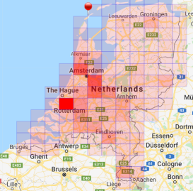
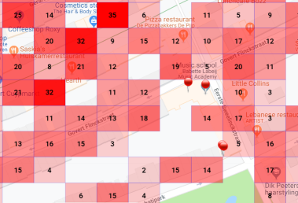

# CoveoGeoHashMap 
This is a branch of the [Coveo Search-ui-seed](https://github.com/coveo/search-ui-seed) a fast starter / seed project to extend the Coveo Javascript Framework.

Read more on [Geohasing](https://en.wikipedia.org/wiki/Geohash).

## Summary
During indexing we translate the lattitude/longitude values into geohashes.
For example: 53.1444/6.04999 translates into u1, u1k, u1kq, u1kq6, u1kq6ft, u1kq6fts geohashes.

In order to display on a Google Map the information from a large index (>9M documents) we need to perform some grouping. The grouping is done using facet values on each geohash. We have geohash2 to geohash8 facets.

Based upon the zoom level of the map the proper field is being choosen and requested (seperately from the normal query) to plot the items on the map. To get the values we call the `listFieldValues` on the SearchEndpoint.

For example: the inital map is displayed with geohash 4 values:

The red squares are the area's, the more red an area is, the more houses are available.
When you search for `Amsterdam`, the map will zoom in into that area and will move to geo hash 5:

Zooming in on the map will update the results and will activate geo hash 6:

Geo hash 6 will also add numbers into the area's.
And clicking even further, will move to the final geo hash level 8:

As you can see, some hashes contain indivdual values, which are being fetched with an additional query.
When you zoom in one more time, the geo hashes will not be displayed anymore and individual values will be retrieved:

Visit the [live map](https://elastic.coveodemo.com/geohash/index.html) to have fun with it. 

## Requirements
Node JS => 8.0

Google Map API key

Coveo Cloud Organization (with data containing lat/long fields)

## Setup

1. Fork / clone the repository.
2. `npm install` at the top of the repository.
3. Configuration of Coveo Cloud and Google API key
4. `npm run watch` at the top of the repository.
5. Open your browser and and paste in the url  

## Get Our Data
For this instance we used houses from the Netherlands and we pushed them into a source. See \Resources\Data.
Important for the data is that they have the proper GeoHash codes in them. The IPE script in \Resources\Data\IPE will add them.

## Structure

The code is written in [typescript](http://www.typescriptlang.org/) and compiled using [webpack](https://webpack.github.io/)

## Build task

* `npm run setup ` will copy the needed ressources (`index.html`, `templates`, etc.) in the `bin` folder.
* `npm run css` will build the sass files into a css file in the `bin` folder.
* `npm run build` will run the `setup`, `css` task, then compile the typescript code.

## Dev

`npm run watch` will start a [webpack dev server](https://webpack.js.org/concepts/). After it finishes, load [http://localhost:3000](http://localhost:3000) in a browser, and the `index.html` page should load.

Then, anytime you hit save in a typescript file, the server will reload your application.

## Useful Visual Studio Code Extensions

If you are using Visual Studio Code, you can install the following extensions:

### [TSLint](https://marketplace.visualstudio.com/items?itemName=eg2.tslint)

Shows inline linter problems in the code based on the `tslint.json` file. This will ensure that you are consistent with the formatting standards. 

